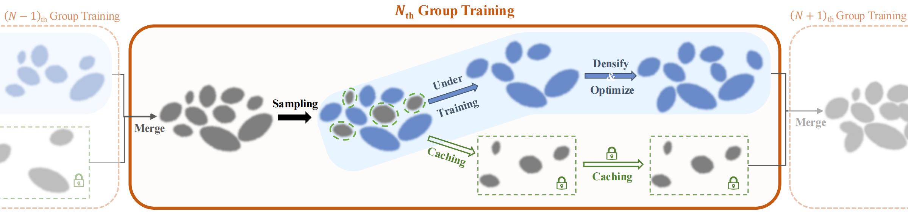

<div align="center">
  <h1 align="center">Faster and Better 3D Splatting via Group Training (ICCV'25)</h1>
  
  <p align="center">
    <a href="https://arxiv.org/pdf/2412.07608" target="_blank" rel="noopener noreferrer"></a>
    <a href="https://arxiv.org/abs/2412.07608"></a>
    <a href="https://chengbo-wang.github.io/3DGS-with-Group-Training/"></a>
  </p>

  <p align="center">
    <a href="https://chengbo-wang.github.io/"><strong>Chengbo Wang</strong></a>
    ·
    <a href="https://guozheng-ma.github.io/"><strong>Guozheng Ma</strong></a>
    ·
    <a href="https://github.com/"><strong>Yifei Xue</strong></a>
    ·
    <a href="https://yizhenlao.github.io/"><strong>Yizhen Lao</strong></a>
  </p>

  </div>


This is the repository for the [(ICCV 2025) Faster and Better 3D Splatting via Group Training website](https://chengbo-wang.github.io/3DGS-with-Group-Training/).
## 💻Overview


**Optimizing all Gaussian primitives concurrently during training is not necessary!** Group Training achieves faster reconstruction speeds by training fewer and more important Gaussian primitives, without compromising reconstruction quality. 


## 🚀Quick Start
Code is coming soon

## 🗒️Checklist

- [ ] Release the code of `Group Training`


## 📑Citation


If you find `3DGS with Group Training` useful for your work please cite:

```bibtex
@article{wang2024faster,
  title={Faster and better 3d splatting via group training},
  author={Wang, Chengbo and Ma, Guozheng and Xue, Yifei and Lao, Yizhen},
  journal={arXiv preprint arXiv:2412.07608},year={2024}
}
```
